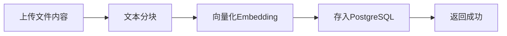
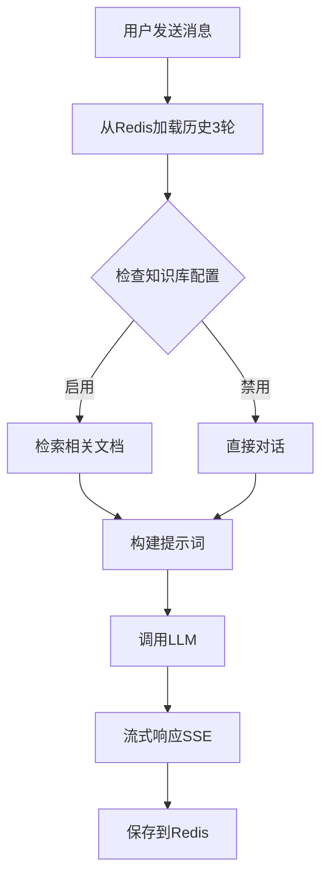

# AI 对话系统需求规格说明书 (SRS)

## 一、系统概述

基于 langchaingo 实现的 AI 对话系统，支持向量知识库检索增强生成（RAG）。系统作为黑盒服务，对外提供简洁的 API 接口。

**参考文档**：https://tmc.github.io/langchaingo/docs

## 二、技术栈

| 组件       | 技术                            |
| ---------- | ------------------------------- |
| 后端语言   | Go 1.24+                        |
| Web 框架   | Gin                             |
| 向量数据库 | PostgreSQL + pgvector           |
| 数据库驱动 | pgx/v5                          |
| 缓存       | Redis（对话历史存储）           |
| AI 框架    | langchaingo（LLM 交互与向量化） |
| 配置管理   | Viper + YAML                    |
| 日志       | Zap + Lumberjack                |

> **注意**：向量维度由 `config.yaml` 中配置的 Embedding 模型自动决定。同一 Collection（知识库表）内的向量维度必须一致。如需更换 Embedding 模型，请清空数据或使用新的 Collection 名称。

---

## 三、项目架构

### 3.1 三层架构

```
HTTP Request
     ↓
┌─────────────────────────────────────┐
│  Handler 层 (internal/handler/)     │  ← 接收请求、参数绑定、调用 Logic、统一响应
└─────────────────────────────────────┘
     ↓
┌─────────────────────────────────────┐
│  Logic 层 (internal/logic/)         │  ← 业务逻辑、编排 Repo 和 aix 服务
└─────────────────────────────────────┘
     ↓
┌─────────────────────────────────────┐
│  Repo 层 (internal/repo/)           │  ← 数据访问、向量库/Redis 交互
└─────────────────────────────────────┘

┌─────────────────────────────────────┐
│  aix 基础设施包 (internal/pkg/aix/) │  ← LLM、Embedding、向量存储封装
└─────────────────────────────────────┘
```

### 3.2 目录结构

```
internal/
├── config/              # 配置结构定义和加载
│   ├── enter.go         # Config 结构体定义（含 AI 配置）
│   └── read.go          # 配置加载逻辑
├── constant/            # 常量定义
│   └── enter.go         # AI 相关常量（Redis Key、Collection 名等）
├── dto/                 # 数据传输对象
│   └── ai.go            # AI 对话相关 DTO
├── etc/                 # 配置文件
│   ├── local.yaml
│   └── template.yaml
├── global/              # 全局变量
│   └── enter.go         # DB、Redis、AIX 实例
├── handler/             # HTTP 处理器
│   └── common.go        # CommonHandler（含 AI 接口）
├── logic/               # 业务逻辑
│   ├── errors.go        # Logic 层错误定义
│   └── common.go        # CommonLogic（含 AI 逻辑）
├── manger/              # 路由管理器
│   └── enter.go
├── middleware/          # 中间件
│   ├── bind.go
│   └── cors.go
├── pkg/                 # 基础设施包
│   ├── aix/             # AI 功能封装（核心）
│   │   ├── enter.go     # AIX 结构体和初始化
│   │   ├── chat.go      # LLM 对话功能
│   │   ├── embedding.go # 向量化功能
│   │   ├── vector.go    # 向量存储功能
│   │   └── history.go   # 对话历史管理
│   ├── pgsqlx/
│   ├── redisx/
│   ├── response/
│   └── zapx/
├── repo/                # 数据访问层
│   ├── errors.go
│   └── ai.go            # AI Repo（向量操作、历史操作）
├── router/
│   └── enter.go
└── main.go
```

---

## 四、核心功能模块

### 4.1 知识库管理



**知识空间类型**（通过 `CollectionName` 区分）：

| 类型    | CollectionName             | 说明         |
| ------- | -------------------------- | ------------ |
| private | `knowledge_user_{user_id}` | 用户私有空间 |
| public  | `knowledge_public`         | 公共空间     |

### 4.2 对话管理



**对话历史规则**：

- 使用 Redis List 存储**完整对话历史**（供前端展示）
- 调用 AI 时**只取最近 3 轮**（6 条消息）作为上下文
- Key 格式: `chat:history:{user_id}:{session_id}`
- TTL: 7 天过期

---

## 五、API 规范

> API 路由放在 `/api/common/` 路由组下

### 5.1 上传文件到知识库

```
POST /api/common/ai/knowledge/upload
```

**请求头**：

- `Authorization`: `Bearer <token>`

**请求参数**：

| 字段       | 类型   | 必填 | 说明                               |
| ---------- | ------ | ---- | ---------------------------------- |
| space_type | string | 是   | 知识空间类型：`private` / `public` |
| content    | string | 是   | 文件文本内容                       |

**请求示例**：

```json
{
  "space_type": "private",
  "content": "这是一份操作手册的内容..."
}
```

**响应示例**：

```json
{
  "code": 0,
  "message": "OK",
  "data": null
}
```

---

### 5.2 AI 对话（流式响应）

```
POST /api/common/ai/chat/stream
```

**请求头**：

- `Authorization`: `Bearer <token>`

**请求参数**：

| 字段       | 类型     | 必填 | 说明                               |
| ---------- | -------- | ---- | ---------------------------------- |
| session_id | string   | 是   | 会话ID（前端生成）                 |
| message    | string   | 是   | 用户消息内容                       |
| images     | []string | 否   | 图片URL列表                        |
| kb_config  | object   | 否   | 知识库查询配置                     |

**kb_config 配置**：

| 字段           | 类型 | 默认值 | 说明                 |
| -------------- | ---- | ------ | -------------------- |
| enabled        | bool | false  | 是否启用知识库检索   |
| search_private | bool | false  | 是否搜索私有知识库   |
| search_public  | bool | false  | 是否搜索公共知识库   |
| top_k          | int  | 3      | 返回最相关的文档数量 |

**请求示例**：

```json
{
  "session_id": "sess_789",
  "message": "请帮我解释一下这个操作步骤",
  "images": ["https://example.com/screenshot.png"],
  "kb_config": {
    "enabled": true,
    "search_private": true,
    "search_public": true,
    "top_k": 3
  }
}
```

**响应格式**：Server-Sent Events (SSE)

```
Content-Type: text/event-stream

event: message
data: {"type": "content", "content": "根据"}

event: message
data: {"type": "content", "content": "您的操作手册"}

event: message
data: {"type": "done", "session_id": "sess_789"}
```

**SSE 事件类型**：

| type    | 说明         |
| ------- | ------------ |
| content | 流式内容片段 |
| error   | 错误信息     |
| done    | 响应完成     |

---

### 5.3 获取对话历史

```
GET /api/common/ai/chat/history
```

**请求头**：

- `Authorization`: `Bearer <token>`

**请求参数**（Query）：

| 字段       | 类型   | 必填 | 说明   |
| ---------- | ------ | ---- | ------ |
| session_id | string | 是   | 会话ID |

**请求示例**：

```
GET /api/common/ai/chat/history?session_id=sess_789
```

**响应参数**：

| 字段     | 类型  | 说明     |
| -------- | ----- | -------- |
| messages | array | 消息列表 |

**messages 结构**：

| 字段      | 类型     | 说明                       |
| --------- | -------- | -------------------------- |
| role      | string   | 角色：`user` / `assistant` |
| content   | string   | 消息内容                   |
| images    | []string | 图片URL列表（可选）        |
| timestamp | int64    | 时间戳（秒）               |

**响应示例**：

```json
{
  "code": 0,
  "message": "OK",
  "data": {
    "messages": [
      {
        "role": "user",
        "content": "你好",
        "images": [],
        "timestamp": 1706500000
      },
      {
        "role": "assistant",
        "content": "你好！有什么可以帮助你的吗？",
        "timestamp": 1706500005
      }
    ]
  }
}
```

---

## 六、DTO 定义

**文件**：`internal/dto/ai.go`

```go
package dto

// 知识库上传
type (
    KnowledgeUploadReq struct {
        UserID    string `json:"user_id" binding:"required"`
        SpaceType string `json:"space_type" binding:"required,oneof=private public"`
        Content   string `json:"content" binding:"required"`
    }
    KnowledgeUploadResp struct {
        Message string `json:"message"`
    }
)

// 知识库配置
type KBConfig struct {
    Enabled       bool `json:"enabled"`
    SearchPrivate bool `json:"search_private"`
    SearchPublic  bool `json:"search_public"`
    TopK          int  `json:"top_k"`
}

// AI 对话
type (
    ChatStreamReq struct {
        UserID    string   `json:"user_id" binding:"required"`
        SessionID string   `json:"session_id" binding:"required"`
        Message   string   `json:"message" binding:"required"`
        Images    []string `json:"images"`
        KBConfig  KBConfig `json:"kb_config"`
    }
)

// SSE 响应事件
type SSEEvent struct {
    Type      string `json:"type"`                 // content / error / done
    Content   string `json:"content,omitempty"`
    SessionID string `json:"session_id,omitempty"`
    Error     string `json:"error,omitempty"`
}

// 获取对话历史
type (
    ChatHistoryReq struct {
        UserID    string `form:"user_id" binding:"required"`
        SessionID string `form:"session_id" binding:"required"`
    }
    ChatHistoryResp struct {
        Messages []ChatMessageItem `json:"messages"`
    }
    ChatMessageItem struct {
        Role      string   `json:"role"`
        Content   string   `json:"content"`
        Images    []string `json:"images,omitempty"`
        Timestamp int64    `json:"timestamp"`
    }
)
```

---

## 七、常量定义

**文件**：`internal/constant/enter.go`

```go
package constant

const (
    // 知识空间类型
    SPACE_TYPE_PRIVATE = "private"
    SPACE_TYPE_PUBLIC  = "public"

    // CollectionName 模板
    COLLECTION_USER_PREFIX = "knowledge_user_%s"//user_id
    COLLECTION_PUBLIC      = "knowledge_public"

    // Redis Key
    CHAT_HISTORY_KEY = "chat:history:%s:%s"  // user_id:session_id

    // 对话历史
    AI_CONTEXT_MESSAGES = 6              // AI 上下文：最近 3 轮问答（6 条消息）
    HISTORY_TTL         = 7 * 24 * 3600  // 7 天（秒）

    // SSE 事件类型
    SSE_TYPE_CONTENT = "content"
    SSE_TYPE_ERROR   = "error"
    SSE_TYPE_DONE    = "done"
)
```

---

## 八、错误定义

### 8.1 Repo 层错误

**文件**：`internal/repo/errors.go`

```go
package repo

import "errors"

var (
    ErrDefault           = errors.New("默认错误")
    ErrVectorStoreInit   = errors.New("向量存储初始化失败")
    ErrDocumentAdd       = errors.New("文档添加失败")
    ErrDocumentSearch    = errors.New("文档检索失败")
    ErrHistoryGet        = errors.New("获取对话历史失败")
    ErrHistorySave       = errors.New("保存对话历史失败")
)
```

### 8.2 Logic 层错误

**文件**：`internal/logic/errors.go`

```go
package logic

import "errors"

var (
    ErrDefault          = errors.New("默认错误")
    ErrKnowledgeUpload  = errors.New("知识库上传失败")
    ErrChatStream       = errors.New("对话流失败")
    ErrInvalidSpaceType = errors.New("无效的知识空间类型")
    ErrLLMGenerate      = errors.New("LLM 生成失败")
    ErrEmbedding        = errors.New("向量化失败")
)
```

---

## 九、aix 基础设施包

**位置**：`internal/pkg/aix/`

### 9.1 结构定义

**文件**：`internal/pkg/aix/enter.go`

```go
package aix

import (
    "context"
    "nurture/internal/config"

    "github.com/go-redis/redis/v8"
    "github.com/tmc/langchaingo/embeddings"
    "github.com/tmc/langchaingo/llms"
)

// AIX 封装所有 AI 相关功能
type AIX struct {
    chatModel llms.Model
    embedder  embeddings.Embedder
    rdb       redis.Cmdable
    pgConnURL string
    config    config.AI
}

// NewAIX 创建 AIX 实例
func NewAIX(cfg config.AI, rdb redis.Cmdable, pgConnURL string) (*AIX, error) {
    // 初始化 Chat 模型
    chatModel, err := newChatModel(cfg.Chat)
    if err != nil {
        return nil, err
    }

    // 初始化 Embedding 模型
    embedder, err := newEmbedder(cfg.Embedding)
    if err != nil {
        return nil, err
    }

    return &AIX{
        chatModel: chatModel,
        embedder:  embedder,
        rdb:       rdb,
        pgConnURL: pgConnURL,
        config:    cfg,
    }, nil
}
```

### 9.2 LLM 对话功能

**文件**：`internal/pkg/aix/chat.go`

```go
package aix

import (
    "context"
    "strings"

    "github.com/tmc/langchaingo/llms"
    "github.com/tmc/langchaingo/llms/openai"
)

func newChatModel(cfg config.ChatModel) (llms.Model, error) {
    return openai.New(
        openai.WithModel(cfg.Model),
        openai.WithToken(cfg.APIKey),
        openai.WithBaseURL(cfg.BaseURL),
    )
}

// StreamChat 流式对话
func (a *AIX) StreamChat(ctx context.Context, messages []llms.MessageContent, 
    streamFunc func(chunk string)) (string, error) {
  
    var fullResponse strings.Builder

    _, err := a.chatModel.GenerateContent(ctx, messages,
        llms.WithStreamingFunc(func(ctx context.Context, chunk []byte) error {
            text := string(chunk)
            fullResponse.WriteString(text)
            streamFunc(text)
            return nil
        }),
    )

    if err != nil {
        return "", err
    }

    return fullResponse.String(), nil
}

// BuildMessages 构建消息（含历史 + RAG 上下文）
func (a *AIX) BuildMessages(history []ChatMessage, userMessage string, 
    images []string, ragContext string) []llms.MessageContent {
  
    var messages []llms.MessageContent

    // 系统提示词
    systemPrompt := "你是一个智能助手。"
    if ragContext != "" {
        systemPrompt += "\n\n以下是相关参考资料：\n" + ragContext + 
            "\n\n请基于以上资料回答用户问题。"
    }
    messages = append(messages, llms.TextParts(llms.ChatMessageTypeSystem, systemPrompt))

    // 历史消息
    for _, msg := range history {
        if msg.Role == "user" {
            messages = append(messages, llms.TextParts(llms.ChatMessageTypeHuman, msg.Content))
        } else {
            messages = append(messages, llms.TextParts(llms.ChatMessageTypeAI, msg.Content))
        }
    }

    // 当前用户消息
    if len(images) > 0 {
        parts := []llms.ContentPart{llms.TextPart(userMessage)}
        for _, imgURL := range images {
            parts = append(parts, llms.ImageURLPart(imgURL))
        }
        messages = append(messages, llms.MessageContent{
            Role:  llms.ChatMessageTypeHuman,
            Parts: parts,
        })
    } else {
        messages = append(messages, llms.TextParts(llms.ChatMessageTypeHuman, userMessage))
    }

    return messages
}
```

### 9.3 向量存储功能

**文件**：`internal/pkg/aix/vector.go`

```go
package aix

import (
    "context"

    "github.com/tmc/langchaingo/schema"
    "github.com/tmc/langchaingo/textsplitter"
    "github.com/tmc/langchaingo/vectorstores"
    "github.com/tmc/langchaingo/vectorstores/pgvector"
)

// AddDocuments 添加文档到知识库
func (a *AIX) AddDocuments(ctx context.Context, collectionName string, content string) error {
    // 1. 文本分块
    splitter := textsplitter.NewRecursiveCharacter(
        textsplitter.WithChunkSize(a.config.Chunking.ChunkSize),
        textsplitter.WithChunkOverlap(a.config.Chunking.ChunkOverlap),
    )
    chunks, err := splitter.SplitText(content)
    if err != nil {
        return err
    }

    // 2. 转换为 Document
    docs := make([]schema.Document, len(chunks))
    for i, chunk := range chunks {
        docs[i] = schema.Document{
            PageContent: chunk,
            Metadata:    map[string]any{},
        }
    }

    // 3. 创建向量存储
    store, err := a.newVectorStore(ctx, collectionName)
    if err != nil {
        return err
    }

    // 4. 添加文档
    _, err = store.AddDocuments(ctx, docs)
    return err
}

// SimilaritySearch 相似度搜索
func (a *AIX) SimilaritySearch(ctx context.Context, query string, 
    collections []string, topK int) ([]schema.Document, error) {
  
    var allDocs []schema.Document

    for _, collName := range collections {
        store, err := a.newVectorStore(ctx, collName)
        if err != nil {
            continue
        }

        docs, err := store.SimilaritySearch(ctx, query, topK,
            vectorstores.WithScoreThreshold(a.config.Retrieval.SimilarityThreshold),
        )
        if err != nil {
            continue
        }
        allDocs = append(allDocs, docs...)
    }

    return allDocs, nil
}

func (a *AIX) newVectorStore(ctx context.Context, collectionName string) (pgvector.Store, error) {
    return pgvector.New(
        ctx,
        pgvector.WithConnectionURL(a.pgConnURL),
        pgvector.WithEmbedder(a.embedder),
        pgvector.WithCollectionName(collectionName),
        pgvector.WithPreDeleteCollection(false),
    )
}
```

### 9.4 对话历史管理

**文件**：`internal/pkg/aix/history.go`

```go
package aix

import (
    "context"
    "encoding/json"
    "fmt"
    "nurture/internal/constant"
    "time"
)

// ChatMessage 对话消息
type ChatMessage struct {
    Role      string   `json:"role"`
    Content   string   `json:"content"`
    Images    []string `json:"images,omitempty"`
    Timestamp int64    `json:"timestamp"`
}

// GetFullHistory 获取完整对话历史（供前端展示）
func (a *AIX) GetFullHistory(ctx context.Context, userID, sessionID string) ([]ChatMessage, error) {
    key := fmt.Sprintf(constant.CHAT_HISTORY_KEY, userID, sessionID)
    data, err := a.rdb.LRange(ctx, key, 0, -1).Result()
    if err != nil {
        return nil, err
    }

    messages := make([]ChatMessage, 0, len(data))
    for _, item := range data {
        var msg ChatMessage
        if err := json.Unmarshal([]byte(item), &msg); err == nil {
            messages = append(messages, msg)
        }
    }
    return messages, nil
}

// GetRecentHistory 获取最近 N 条历史（供 AI 上下文使用）
func (a *AIX) GetRecentHistory(ctx context.Context, userID, sessionID string, limit int) ([]ChatMessage, error) {
    key := fmt.Sprintf(constant.CHAT_HISTORY_KEY, userID, sessionID)
    // 从末尾取最近 limit 条
    data, err := a.rdb.LRange(ctx, key, int64(-limit), -1).Result()
    if err != nil {
        return nil, err
    }

    messages := make([]ChatMessage, 0, len(data))
    for _, item := range data {
        var msg ChatMessage
        if err := json.Unmarshal([]byte(item), &msg); err == nil {
            messages = append(messages, msg)
        }
    }
    return messages, nil
}

// SaveMessage 保存消息（不裁剪，保留完整历史）
func (a *AIX) SaveMessage(ctx context.Context, userID, sessionID string, msg ChatMessage) error {
    key := fmt.Sprintf(constant.CHAT_HISTORY_KEY, userID, sessionID)
    data, _ := json.Marshal(msg)

    pipe := a.rdb.Pipeline()
    pipe.RPush(ctx, key, data)
    pipe.Expire(ctx, key, time.Duration(constant.HISTORY_TTL)*time.Second)
    _, err := pipe.Exec(ctx)
    return err
}
```

---

## 十、三层架构实现

### 10.1 Repo 层

**文件**：`internal/repo/ai.go`

```go
package repo

import (
    "context"
    "nurture/internal/global"
    "nurture/internal/pkg/aix"

    "github.com/tmc/langchaingo/schema"
)

type IAIRepo interface {
    AddDocuments(ctx context.Context, collectionName, content string) error
    SimilaritySearch(ctx context.Context, query string, collections []string, topK int) ([]schema.Document, error)
    GetFullHistory(ctx context.Context, userID, sessionID string) ([]aix.ChatMessage, error)
    GetRecentHistory(ctx context.Context, userID, sessionID string, limit int) ([]aix.ChatMessage, error)
    SaveMessage(ctx context.Context, userID, sessionID string, msg aix.ChatMessage) error
}

type AIRepo struct{}

func NewAIRepo() *AIRepo {
    return &AIRepo{}
}

var _ IAIRepo = (*AIRepo)(nil)

func (r *AIRepo) AddDocuments(ctx context.Context, collectionName, content string) error {
    err := global.AIX.AddDocuments(ctx, collectionName, content)
    if err != nil {
        global.Log.Error(err)
        return ErrDocumentAdd
    }
    return nil
}

func (r *AIRepo) SimilaritySearch(ctx context.Context, query string, 
    collections []string, topK int) ([]schema.Document, error) {
  
    docs, err := global.AIX.SimilaritySearch(ctx, query, collections, topK)
    if err != nil {
        global.Log.Error(err)
        return nil, ErrDocumentSearch
    }
    return docs, nil
}

func (r *AIRepo) GetFullHistory(ctx context.Context, userID, sessionID string) ([]aix.ChatMessage, error) {
    history, err := global.AIX.GetFullHistory(ctx, userID, sessionID)
    if err != nil {
        global.Log.Error(err)
        return nil, ErrHistoryGet
    }
    return history, nil
}

func (r *AIRepo) GetRecentHistory(ctx context.Context, userID, sessionID string, limit int) ([]aix.ChatMessage, error) {
    history, err := global.AIX.GetRecentHistory(ctx, userID, sessionID, limit)
    if err != nil {
        global.Log.Error(err)
        return nil, ErrHistoryGet
    }
    return history, nil
}

func (r *AIRepo) SaveMessage(ctx context.Context, userID, sessionID string, msg aix.ChatMessage) error {
    err := global.AIX.SaveMessage(ctx, userID, sessionID, msg)
    if err != nil {
        global.Log.Error(err)
        return ErrHistorySave
    }
    return nil
}
```

### 10.2 Logic 层

**文件**：`internal/logic/common.go`（AI 相关方法）

```go
package logic

import (
    "context"
    "fmt"
    "nurture/internal/constant"
    "nurture/internal/dto"
    "nurture/internal/global"
    "nurture/internal/pkg/aix"
    "nurture/internal/repo"
    "strings"
    "time"
)

type ICommonLogic interface {
    UploadKnowledge(ctx context.Context, req dto.KnowledgeUploadReq) error
    ChatStream(ctx context.Context, req dto.ChatStreamReq, streamFunc func(event dto.SSEEvent)) error
    GetChatHistory(ctx context.Context, req dto.ChatHistoryReq) (dto.ChatHistoryResp, error)
}

type CommonLogic struct {
    aiRepo *repo.AIRepo
}

func NewCommonLogic() *CommonLogic {
    return &CommonLogic{
        aiRepo: repo.NewAIRepo(),
    }
}

var _ ICommonLogic = (*CommonLogic)(nil)

// UploadKnowledge 上传知识库
func (l *CommonLogic) UploadKnowledge(ctx context.Context, req dto.KnowledgeUploadReq) error {
    // 构建 CollectionName
    var collectionName string
    switch req.SpaceType {
    case constant.SPACE_TYPE_PRIVATE:
        collectionName = constant.COLLECTION_USER_PREFIX + req.UserID
    case constant.SPACE_TYPE_PUBLIC:
        collectionName = constant.COLLECTION_PUBLIC
    default:
        return ErrInvalidSpaceType
    }

    // 添加文档
    err := l.aiRepo.AddDocuments(ctx, collectionName, req.Content)
    if err != nil {
        global.Log.Error(err)
        return ErrKnowledgeUpload
    }
    return nil
}

// ChatStream 流式对话
func (l *CommonLogic) ChatStream(ctx context.Context, req dto.ChatStreamReq, 
    streamFunc func(event dto.SSEEvent)) error {
  
    // 1. 获取最近 3 轮对话历史（6 条消息）作为 AI 上下文
    history, err := l.aiRepo.GetRecentHistory(ctx, req.UserID, req.SessionID, constant.AI_CONTEXT_MESSAGES)
    if err != nil {
        global.Log.Error(err)
        // 历史获取失败不阻断，继续对话
        history = []aix.ChatMessage{}
    }

    // 2. RAG 检索（如果启用）
    var ragContext string
    if req.KBConfig.Enabled {
        collections := l.buildCollections(req.UserID, req.KBConfig)
        topK := req.KBConfig.TopK
        if topK <= 0 {
            topK = 3
        }

        docs, err := l.aiRepo.SimilaritySearch(ctx, req.Message, collections, topK)
        if err == nil && len(docs) > 0 {
            var parts []string
            for _, doc := range docs {
                parts = append(parts, doc.PageContent)
            }
            ragContext = strings.Join(parts, "\n\n---\n\n")
        }
    }

    // 3. 构建消息
    messages := global.AIX.BuildMessages(history, req.Message, req.Images, ragContext)

    // 4. 流式对话
    fullResponse, err := global.AIX.StreamChat(ctx, messages, func(chunk string) {
        streamFunc(dto.SSEEvent{
            Type:    constant.SSE_TYPE_CONTENT,
            Content: chunk,
        })
    })
    if err != nil {
        global.Log.Error(err)
        streamFunc(dto.SSEEvent{
            Type:  constant.SSE_TYPE_ERROR,
            Error: ErrLLMGenerate.Error(),
        })
        return ErrLLMGenerate
    }

    // 5. 保存对话历史
    now := time.Now().Unix()
    _ = l.aiRepo.SaveMessage(ctx, req.UserID, req.SessionID, aix.ChatMessage{
        Role:      "user",
        Content:   req.Message,
        Images:    req.Images,
        Timestamp: now,
    })
    _ = l.aiRepo.SaveMessage(ctx, req.UserID, req.SessionID, aix.ChatMessage{
        Role:      "assistant",
        Content:   fullResponse,
        Timestamp: now,
    })

    // 6. 发送完成事件
    streamFunc(dto.SSEEvent{
        Type:      constant.SSE_TYPE_DONE,
        SessionID: req.SessionID,
    })

    return nil
}

// GetChatHistory 获取完整对话历史（供前端展示）
func (l *CommonLogic) GetChatHistory(ctx context.Context, req dto.ChatHistoryReq) (dto.ChatHistoryResp, error) {
    var resp dto.ChatHistoryResp

    history, err := l.aiRepo.GetFullHistory(ctx, req.UserID, req.SessionID)
    if err != nil {
        global.Log.Error(err)
        return resp, ErrDefault
    }

    resp.Messages = make([]dto.ChatMessageItem, len(history))
    for i, msg := range history {
        resp.Messages[i] = dto.ChatMessageItem{
            Role:      msg.Role,
            Content:   msg.Content,
            Images:    msg.Images,
            Timestamp: msg.Timestamp,
        }
    }

    return resp, nil
}

func (l *CommonLogic) buildCollections(userID string, cfg dto.KBConfig) []string {
    var collections []string
    if cfg.SearchPrivate {
        collections = append(collections, constant.COLLECTION_USER_PREFIX+userID)
    }
    if cfg.SearchPublic {
        collections = append(collections, constant.COLLECTION_PUBLIC)
    }
    return collections
}
```

### 10.3 Handler 层

**文件**：`internal/handler/common.go`（AI 相关方法）

```go
package handler

import (
    "encoding/json"
    "nurture/internal/dto"
    "nurture/internal/logic"
    "nurture/internal/middleware"
    "nurture/internal/pkg/response"

    "github.com/gin-gonic/gin"
)

type CommonHandler struct {
    commonLogic *logic.CommonLogic
}

func NewCommonHandler() *CommonHandler {
    return &CommonHandler{
        commonLogic: logic.NewCommonLogic(),
    }
}

// UploadKnowledge 上传知识库
func (h *CommonHandler) UploadKnowledge(c *gin.Context) {
    req := middleware.GetBind[dto.KnowledgeUploadReq](c)
    err := h.commonLogic.UploadKnowledge(c.Request.Context(), req)
    response.Response(c, nil, err)
}

// ChatStream AI 对话（SSE 流式响应）
func (h *CommonHandler) ChatStream(c *gin.Context) {
    req := middleware.GetBind[dto.ChatStreamReq](c)

    // 设置 SSE 响应头
    c.Header("Content-Type", "text/event-stream")
    c.Header("Cache-Control", "no-cache")
    c.Header("Connection", "keep-alive")

    // 流式回调
    streamFunc := func(event dto.SSEEvent) {
        data, _ := json.Marshal(event)
        c.SSEvent("message", string(data))
        c.Writer.Flush()
    }

    // 执行对话
    _ = h.commonLogic.ChatStream(c.Request.Context(), req, streamFunc)
}

// GetChatHistory 获取对话历史
func (h *CommonHandler) GetChatHistory(c *gin.Context) {
    req := middleware.GetBind[dto.ChatHistoryReq](c)
    resp, err := h.commonLogic.GetChatHistory(c.Request.Context(), req)
    response.Response(c, resp, err)
}
```

### 10.4 路由注册

**文件**：`internal/router/enter.go`

```go
package router

func registerRoutes(routeManager *manager.RouteManager) {
    routeManager.RegisterCommonRoutes(func(rg *gin.RouterGroup) {
        commonHandler := handler.NewCommonHandler()

        // 健康检查
        rg.GET("/ping", func(c *gin.Context) {
            response.Response(c, "pong", nil)
        })

        // AI 相关接口
        ai := rg.Group("/ai")
        {
            // 知识库上传
            ai.POST("/knowledge/upload",
                middleware.BindJsonMiddleware[dto.KnowledgeUploadReq],
                commonHandler.UploadKnowledge,
            )

            // 流式对话
            ai.POST("/chat/stream",
                middleware.BindJsonMiddleware[dto.ChatStreamReq],
                commonHandler.ChatStream,
            )

            // 获取对话历史
            ai.GET("/chat/history",
                middleware.BindQueryMiddleware[dto.ChatHistoryReq],
                commonHandler.GetChatHistory,
            )
        }
    })
}
```

---

## 十一、全局变量

**文件**：`internal/global/enter.go`

```go
package global

import (
    "nurture/internal/config"
    "nurture/internal/pkg/aix"
    "nurture/internal/pkg/pgsqlx"
    "nurture/internal/pkg/redisx"
    "nurture/internal/pkg/zapx"

    "github.com/go-redis/redis/v8"
    "github.com/jackc/pgx/v5/pgxpool"
    "go.uber.org/zap"
)

var (
    Log *zap.SugaredLogger
    DB  *pgxpool.Pool
    RDB redis.Cmdable
    AIX *aix.AIX  // AI 功能实例
)

func Init() {
    Log = zapx.InitZap()
    DB = pgsqlx.InitPgsql()
    RDB = redisx.InitRedis()

    // 初始化 AIX
    var err error
    AIX, err = aix.NewAIX(config.Conf.AI, RDB, config.Conf.DB.DSN())
    if err != nil {
        panic("AIX init failed: " + err.Error())
    }
}
```

---

## 十二、配置结构

### 12.1 配置定义

**文件**：`internal/config/enter.go`（AI 配置部分）

```go
package config

type Config struct {
    App   App   `mapstructure:"app"`
    DB    DB    `mapstructure:"db"`
    Redis Redis `mapstructure:"redis"`
    AI    AI    `mapstructure:"ai"`  // AI 配置
}

// AI 配置
type AI struct {
    Chat      ChatModel      `mapstructure:"chat"`
    Embedding EmbeddingModel `mapstructure:"embedding"`
    Chunking  Chunking       `mapstructure:"chunking"`
    Retrieval Retrieval      `mapstructure:"retrieval"`
}

type ChatModel struct {
    Provider string `mapstructure:"provider"`
    Model    string `mapstructure:"model"`
    APIKey   string `mapstructure:"api_key"`
    BaseURL  string `mapstructure:"base_url"`
}

type EmbeddingModel struct {
    Provider string `mapstructure:"provider"`
    Model    string `mapstructure:"model"`
    APIKey   string `mapstructure:"api_key"`
    BaseURL  string `mapstructure:"base_url"`
}

type Chunking struct {
    ChunkSize    int `mapstructure:"chunk_size"`
    ChunkOverlap int `mapstructure:"chunk_overlap"`
}

type Retrieval struct {
    DefaultTopK         int     `mapstructure:"default_top_k"`
    SimilarityThreshold float32 `mapstructure:"similarity_threshold"`
}
```

### 12.2 配置文件

**文件**：`internal/etc/template.yaml`

```yaml
app:
  host: 127.0.0.1
  port: 8080
  env: dev
  log: logs

db:
  host: 127.0.0.1
  port: 5432
  username: nurture
  password: 123456
  dbname: nurture

redis:
  host: 127.0.0.1
  port: 6379
  password:
  db: 0
  enable: true

ai:
  chat:
    provider: openai
    model: gpt-4
    api_key: ${CHAT_API_KEY}
    base_url: ""
  embedding:
    provider: openai
    model: text-embedding-ada-002
    api_key: ${EMBEDDING_API_KEY}
    base_url: ""
  chunking:
    chunk_size: 1000
    chunk_overlap: 200
  retrieval:
    default_top_k: 3
    similarity_threshold: 0.7
```

---

## 十三、数据模型

### 13.1 PostgreSQL - 向量表

langchaingo pgvector 自动创建：

```sql
-- 集合表
CREATE TABLE langchain_pg_collection (
    uuid UUID PRIMARY KEY DEFAULT gen_random_uuid(),
    name VARCHAR(255) UNIQUE NOT NULL,
    cmetadata JSONB
);

-- 向量表
CREATE TABLE langchain_pg_embedding (
    uuid UUID PRIMARY KEY DEFAULT gen_random_uuid(),
    collection_id UUID REFERENCES langchain_pg_collection(uuid) ON DELETE CASCADE,
    embedding VECTOR(1536),
    document TEXT NOT NULL,
    cmetadata JSONB
);

-- HNSW 索引
CREATE INDEX ON langchain_pg_embedding 
USING hnsw (embedding vector_cosine_ops)
WITH (m = 16, ef_construction = 64);
```

### 13.2 Redis - 对话历史

| Key 格式                              | Value 类型  | TTL  |
| ------------------------------------- | ----------- | ---- |
| `chat:history:{user_id}:{session_id}` | List (JSON) | 7 天 |

**Value 结构**：

```json
{"role": "user", "content": "消息内容", "images": ["url"], "timestamp": 1706500000}
{"role": "assistant", "content": "AI回复", "timestamp": 1706500005}
```