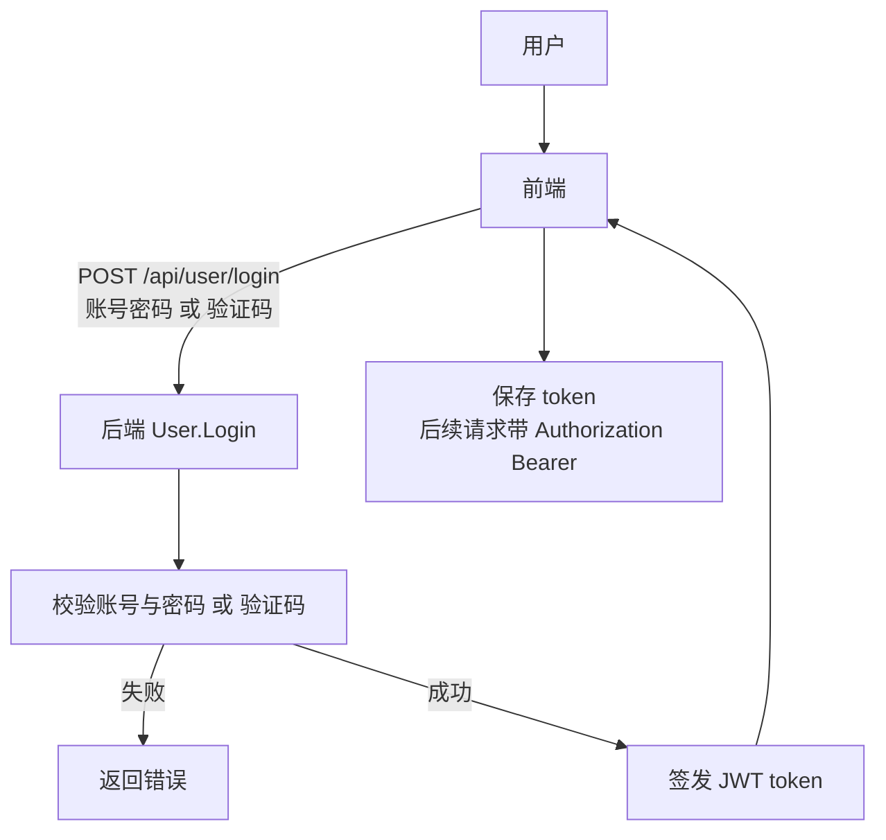
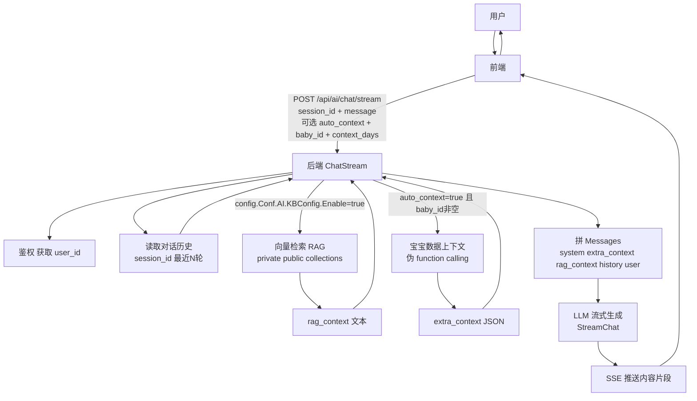
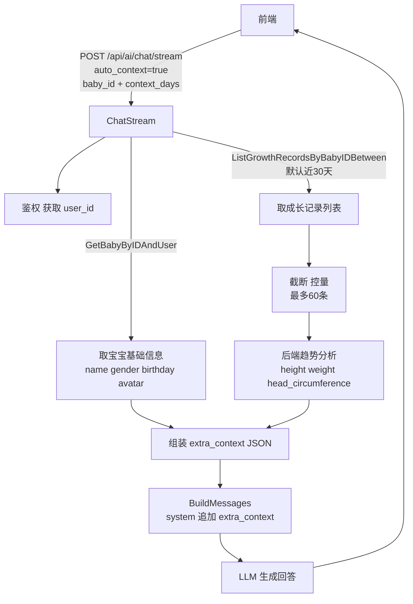
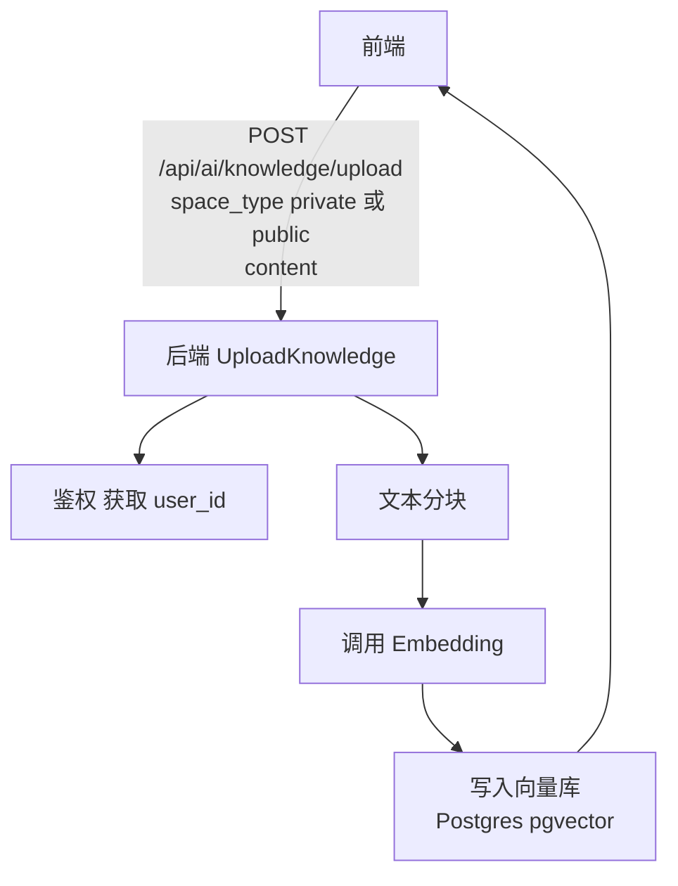
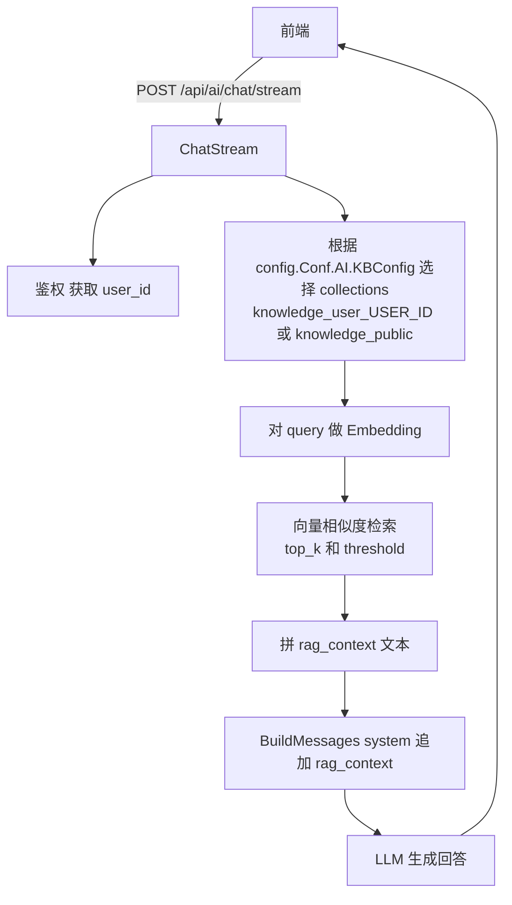
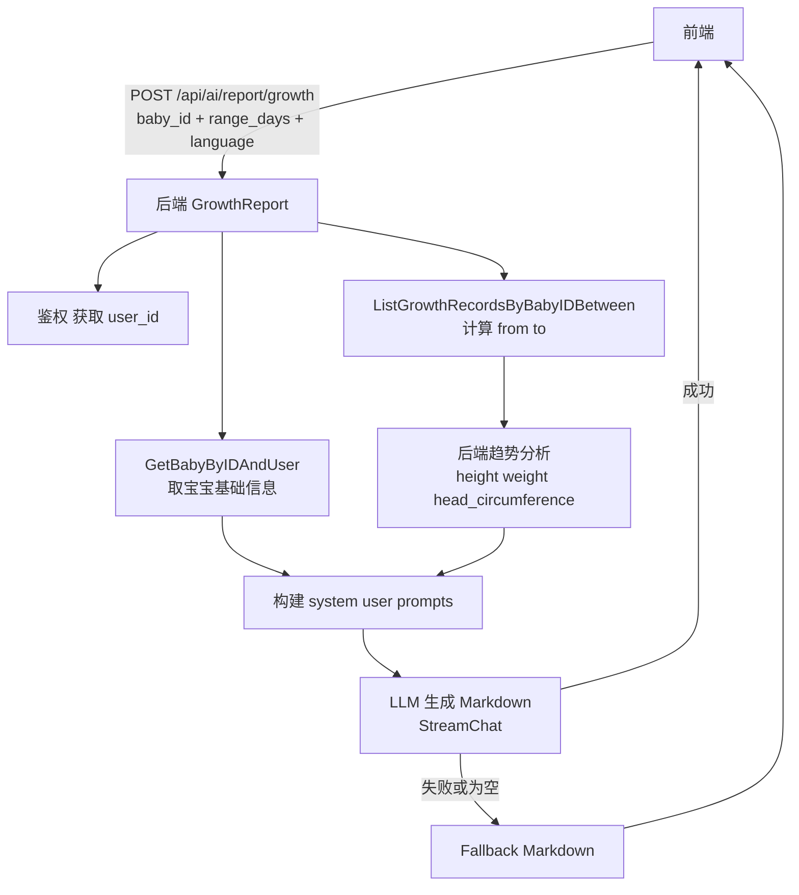

## 流程图：登录 获取 token

```mermaid
flowchart TD
  U[用户] --> FE[前端]
  FE -->|POST /api/user/login<br/>账号密码 或 验证码| API[后端 User.Login]
  API --> V[校验账号与密码 或 验证码]
  V -->|失败| E[返回错误]
  V -->|成功| T[签发 JWT token]
  T --> FE
  FE --> S[保存 token<br/>后续请求带 Authorization Bearer]
```

## 流程图：AI 助手对话主流程 ChatStream

```mermaid
flowchart TD
  U[用户] --> FE[前端]
  FE -->|POST /api/ai/chat/stream<br/>session_id + message<br/>可选 auto_context + baby_id + context_days| API[后端 ChatStream]

  API --> AUTH[鉴权 获取 user_id]

  API --> H[读取对话历史<br/>session_id 最近N轮]
  H --> API

  API -->|config.Conf.AI.KBConfig.Enable=true| RAG[向量检索 RAG<br/>private public collections]
  RAG --> RC[rag_context 文本]
  RC --> API

  API -->|auto_context=true 且 baby_id非空| BC[宝宝数据上下文<br/>伪 function calling]
  BC --> EC[extra_context JSON]
  EC --> API

  API --> PM[拼 Messages<br/>system extra_context rag_context history user]
  PM --> LLM[LLM 流式生成<br/>StreamChat]
  LLM --> SSE[SSE 推送内容片段]
  SSE --> FE
  FE --> U
```

## 流程图：成长记录注入

```mermaid
flowchart TD
  FE[前端] -->|POST /api/ai/chat/stream<br/>auto_context=true<br/>baby_id + context_days| API[ChatStream]

  API --> AUTH[鉴权 获取 user_id]

  API -->|GetBabyByIDAndUser| BABY[取宝宝基础信息<br/>name gender birthday avatar]
  API -->|ListGrowthRecordsByBabyIDBetween<br/>默认近30天| GR[取成长记录列表]

  GR --> CUT[截断 控量<br/>最多60条]
  CUT --> ANA[后端趋势分析<br/>height weight head_circumference]

  BABY --> PACK[组装 extra_context JSON]
  ANA --> PACK

  PACK --> MSG[BuildMessages<br/>system 追加 extra_context]
  MSG --> LLM[LLM 生成回答]
  LLM --> FE

```

## 流程图：RAG 知识库上传

```mermaid
flowchart TD
  FE[前端] -->|POST /api/ai/knowledge/upload<br/>space_type private 或 public<br/>content| API[后端 UploadKnowledge]
  API --> AUTH[鉴权 获取 user_id]
  API --> CHUNK[文本分块]
  CHUNK --> EMB[调用 Embedding]
  EMB --> STORE[写入向量库<br/>Postgres pgvector]
  STORE --> FE
```

## 流程图：RAG 检索与拼接（对话时）

```mermaid
flowchart TD
  FE[前端] -->|POST /api/ai/chat/stream| API[ChatStream]
  API --> AUTH[鉴权 获取 user_id]
  API --> COL["根据 config.Conf.AI.KBConfig 选择 collections<br/>knowledge_user_USER_ID 或 knowledge_public"]
  COL --> QEMB[对 query 做 Embedding]
  QEMB --> SEARCH["向量相似度检索<br/>top_k 和 threshold"]
  SEARCH --> CTX[拼 rag_context 文本]
  CTX --> MSG[BuildMessages system 追加 rag_context]
  MSG --> LLM[LLM 生成回答]
  LLM --> FE
```

## 流程图：成长报告生成（Markdown）

```mermaid
flowchart TD
  FE[前端] -->|POST /api/ai/report/growth<br/>baby_id + range_days + language| API[后端 GrowthReport]
  API --> AUTH[鉴权 获取 user_id]
  API --> BABY[GetBabyByIDAndUser<br/>取宝宝基础信息]
  API --> GR[ListGrowthRecordsByBabyIDBetween<br/>计算 from to]
  GR --> ANA[后端趋势分析<br/>height weight head_circumference]
  BABY --> PROMPT[构建 system user prompts]
  ANA --> PROMPT
  PROMPT --> LLM[LLM 生成 Markdown<br/>StreamChat]
  LLM -->|失败或为空| FALL[Fallback Markdown]
  LLM -->|成功| FE
  FALL --> FE
```
