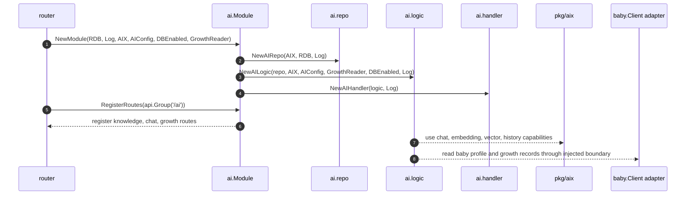
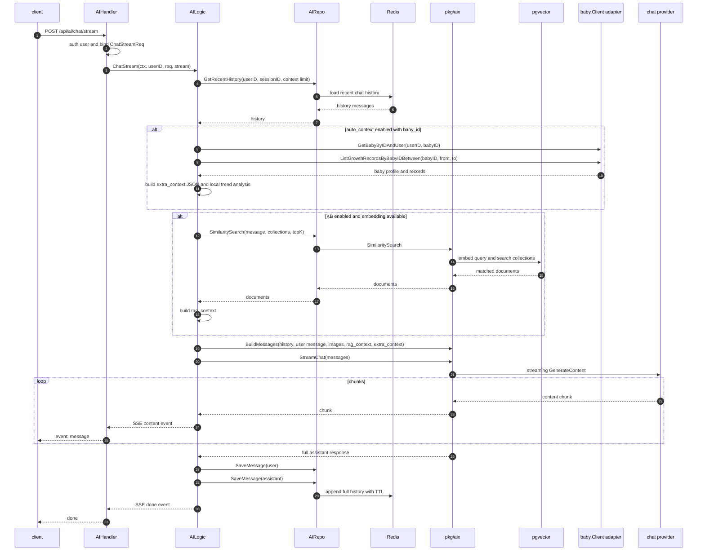
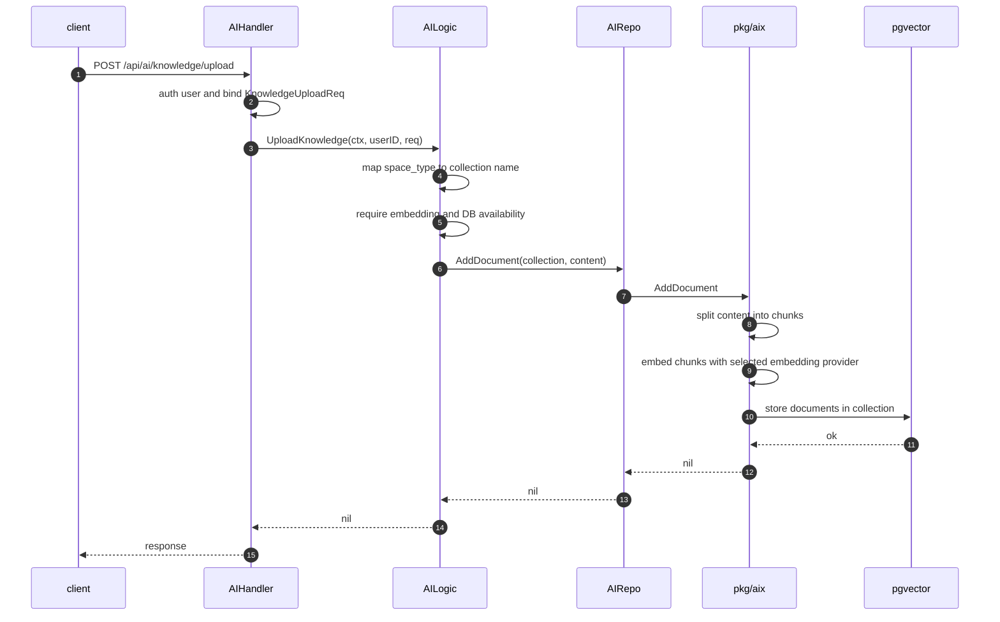
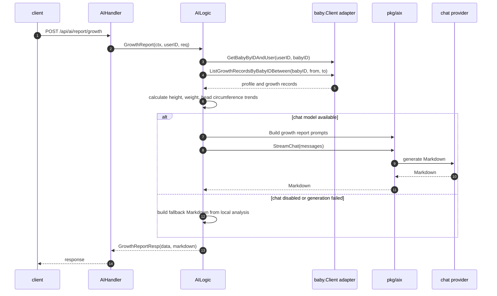

# AI 模块主链路

本文档记录 `internal/ai` 的主要业务链路。AI 模块负责 HTTP 入口、对话编排、知识库上传、成长分析和成长报告；模型、Embedding、向量库与历史存储能力由业务无关的 `internal/pkg/aix` 提供。

## 模块启动链路

## 对话流链路

## 知识库上传链路

## 成长报告链路

## 边界说明

- AI 模块不直接初始化模型或外部客户端，`AIX`、Redis、日志和 baby 读取能力都由上层注入；当前 baby 读取由 router 中的 adapter 基于 `baby.Client` 提供。
- `chat.enable` 与 `embedding.enable` 分开判断：普通对话、知识库上传、RAG 检索和成长报告可以按能力降级。
- 知识库固定策略放在 `internal/config` 的 AI 配置与 `internal/ai/constant` 中；DTO 不承载配置。
