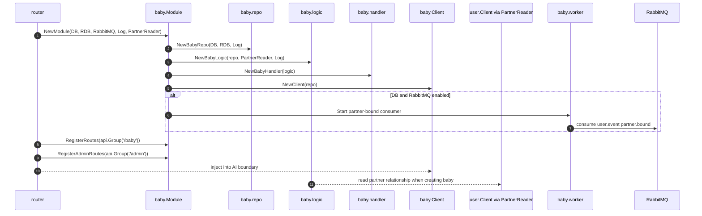
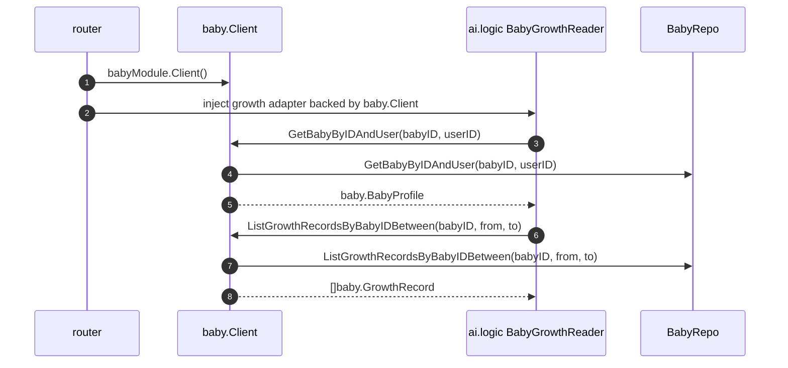
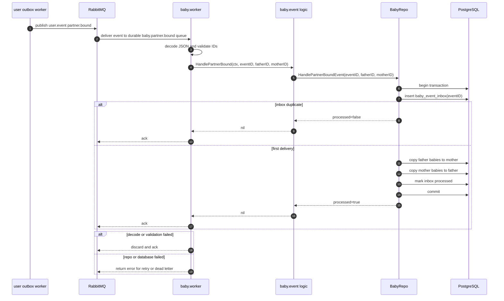
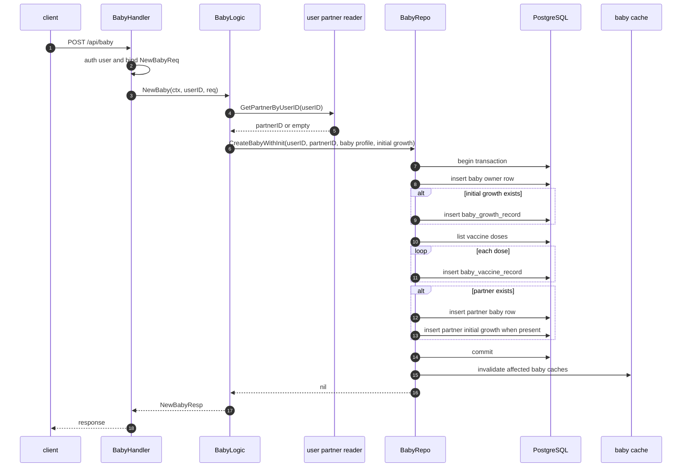
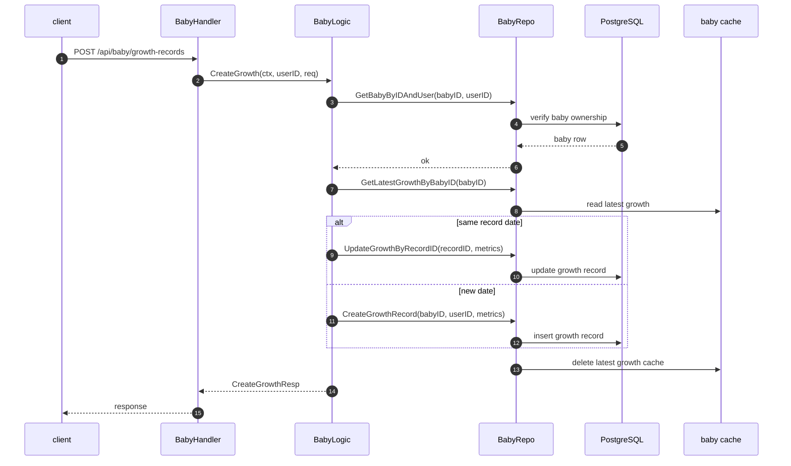
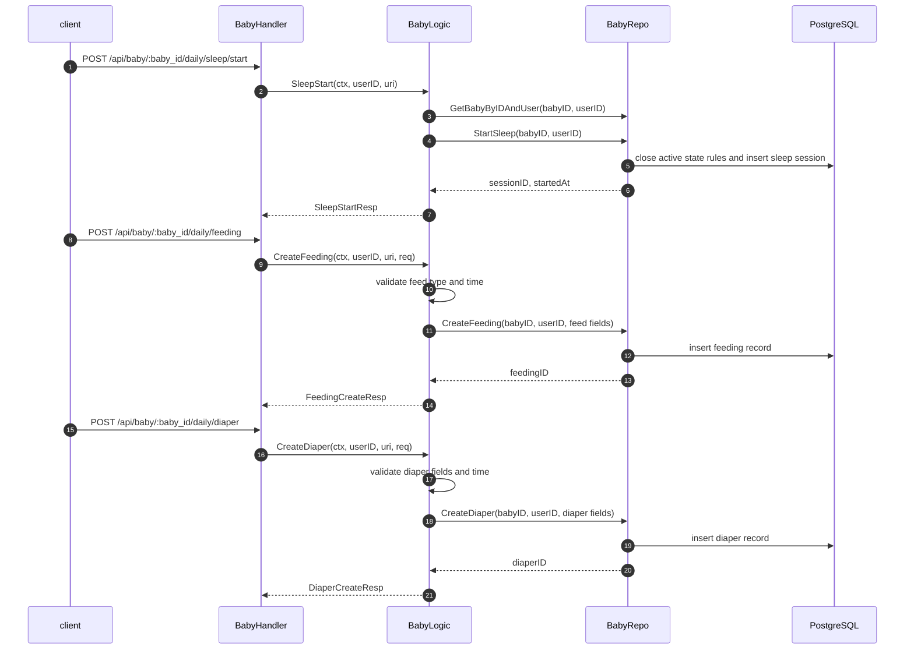
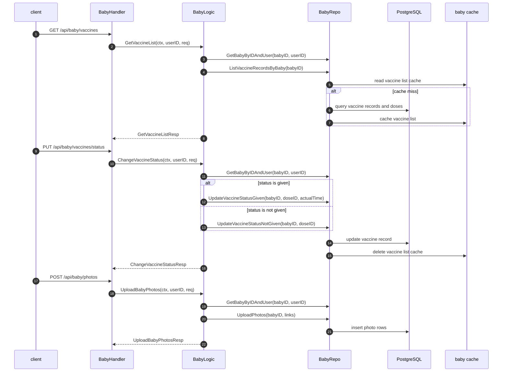

# Baby 模块主链路

本文档记录 `internal/baby` 的主要业务链路。Baby 模块拥有宝宝资料、成长记录、疫苗记录、日常喂养/睡眠/尿布和相册的独立 SQL、repo/cache、handler/logic 边界。

## 模块启动链路

## Client 边界链路

## 伴侣绑定事件消费链路

## 新建宝宝链路

## 成长记录链路

## 日常记录链路

## 疫苗与相册链路

