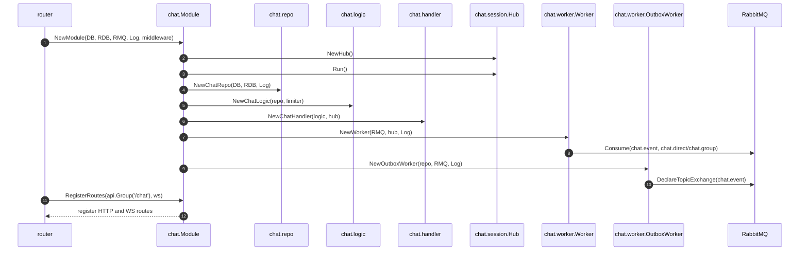
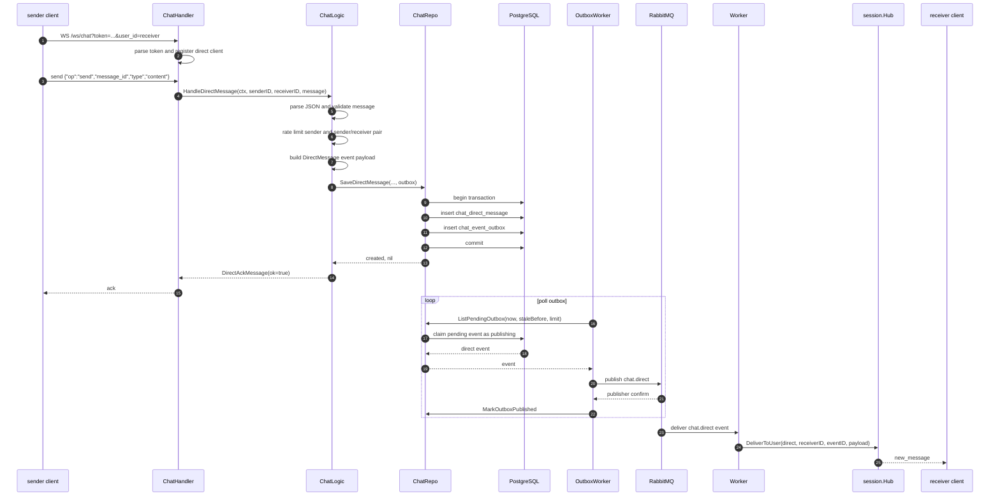
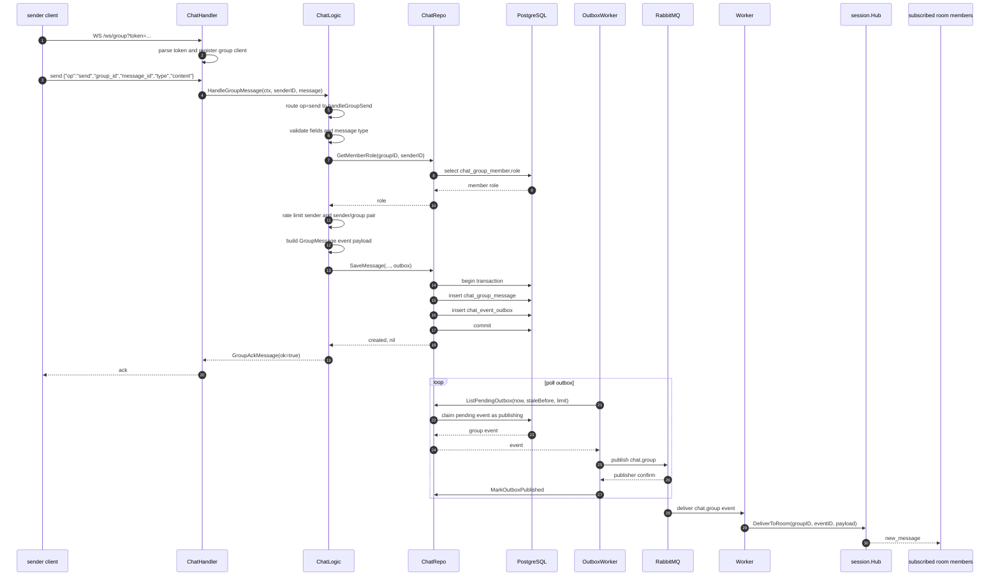
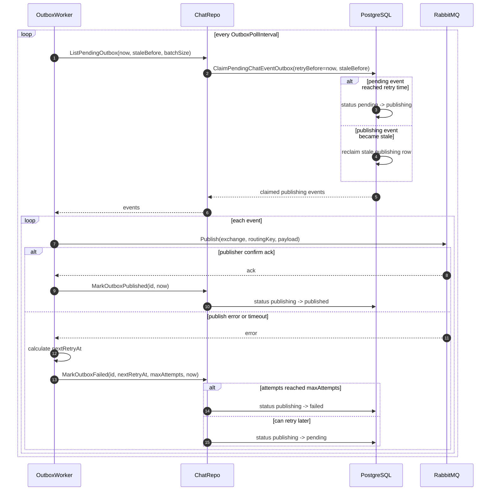
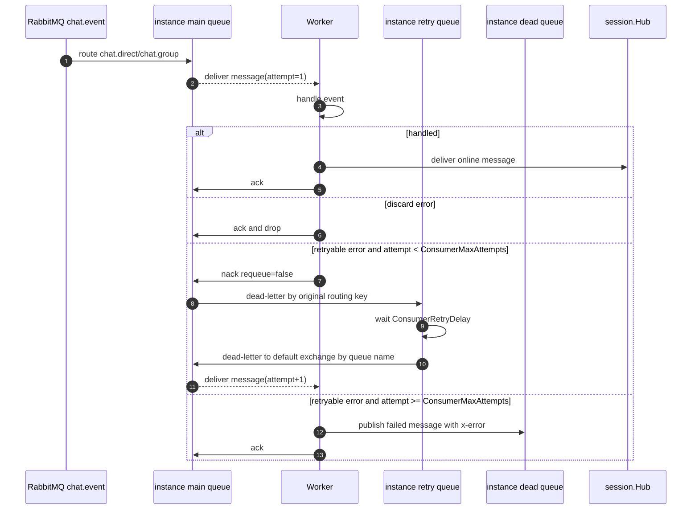
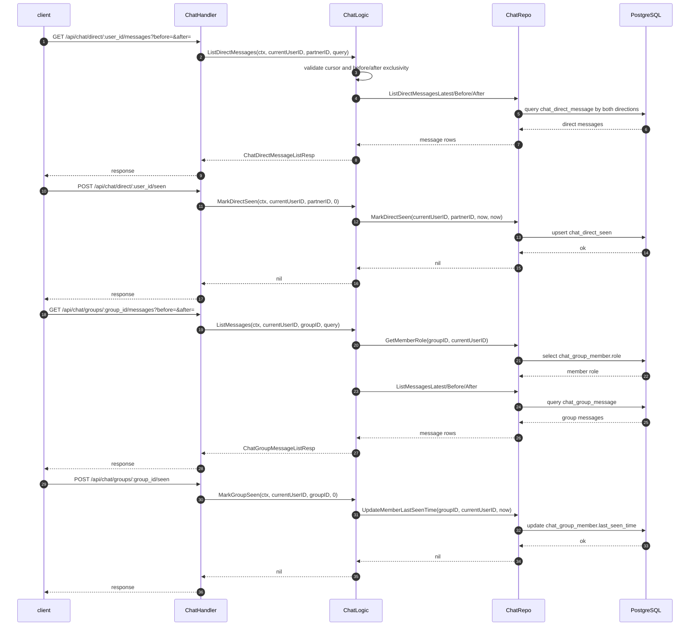
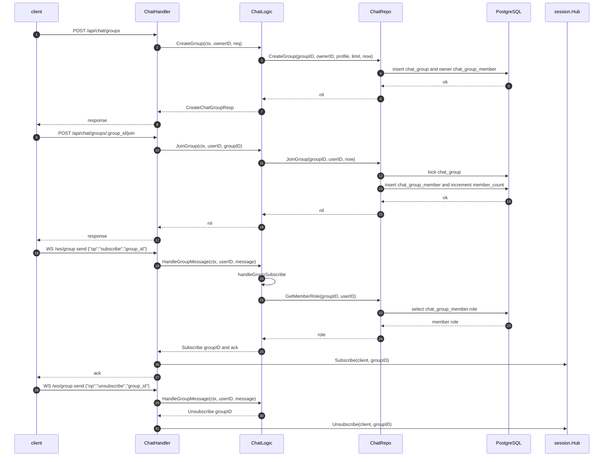

# Chat 模块主链路

本文档记录 `internal/chat` 的主要业务链路。所有图使用 Mermaid `sequenceDiagram`，通过 `participant` 表达泳道。

## 模块启动链路

## 私聊发送链路

## 群聊发送链路

## Outbox 投递与重试链路

## RabbitMQ 消费侧 DLQ 重试链路

## 会话同步与已读链路

## 群成员与订阅链路

