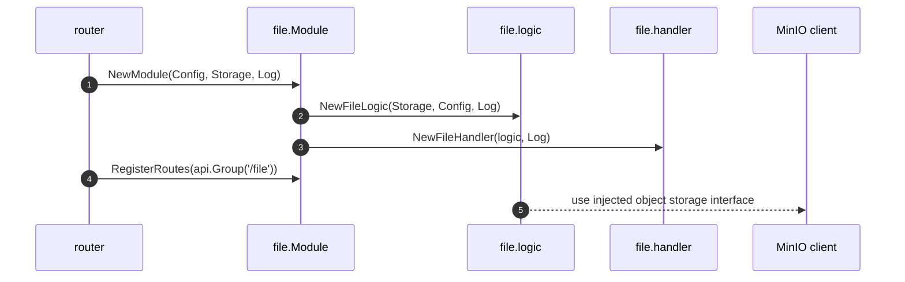
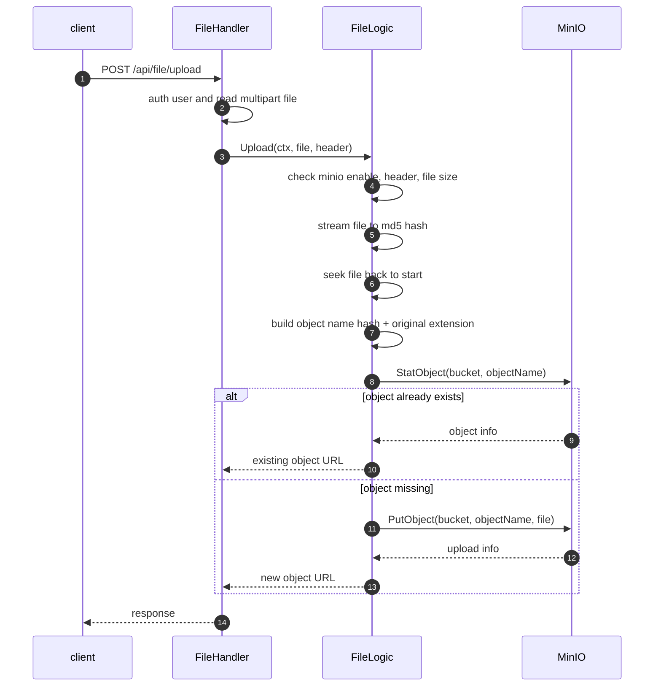

# File 模块主链路

本文档记录 `internal/file` 的主要业务链路。File 模块只负责业务上传入口和对象 URL 生成，真正的 MinIO client 由 `internal/pkg/miniox` 初始化后注入。

## 模块启动链路

## 文件上传链路

## 边界说明

- File 模块不处理具体对象存储初始化，不读取 `global`。
- 上传去重依据文件内容 MD5，同内容文件复用同一个对象名。
- 文件大小、默认路径等固定策略放在 `internal/file/constant`。
