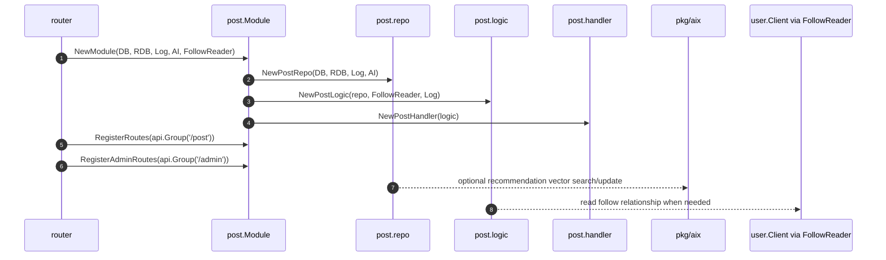
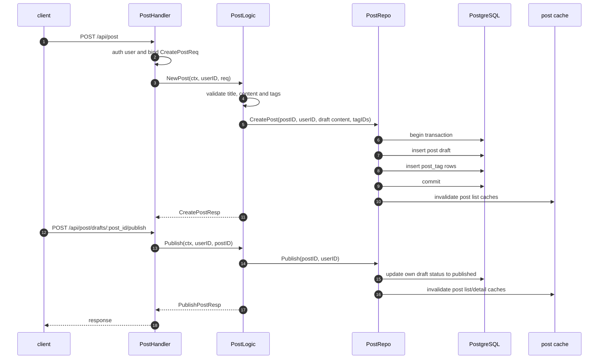
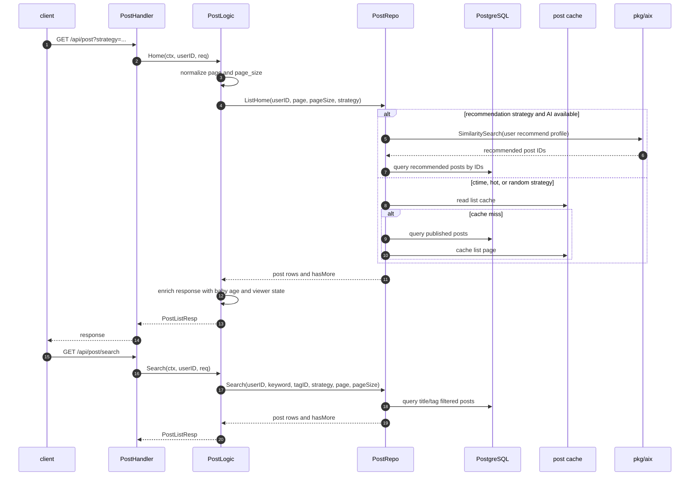
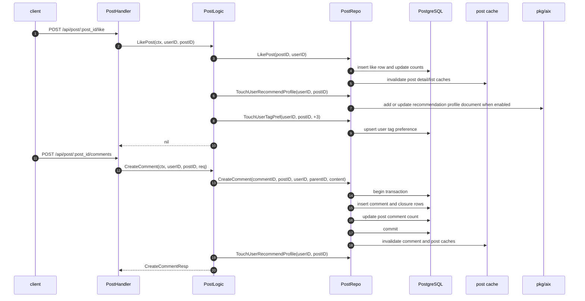

# Post 模块主链路

本文档记录 `internal/post` 的主要业务链路。Post 模块拥有文章、标签、评论、点赞、收藏、关注 feed 和推荐画像的独立 SQL、repo/cache、handler/logic 边界。

## 模块启动链路

## 草稿与发布链路

## 首页与搜索链路

## 互动与推荐画像链路

## 边界说明

- Post 模块通过注入的 `FollowReader` 读取用户关注关系；当前由 `user.Client` 提供实现，不直接依赖 user 模块内部 repo/logic。
- 推荐依赖注入的 `pkg/aix`，AI 不可用时 feed/search 仍保持基础查询能力。
- 标签管理在模块内提供 admin routes，顶层 router 只负责挂到 `/api/admin`。
