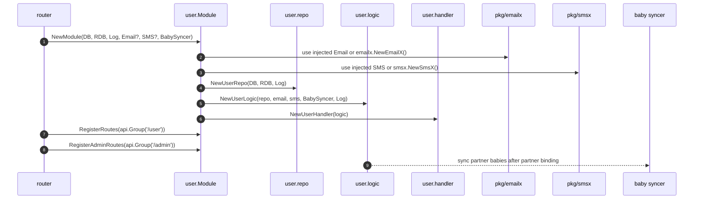
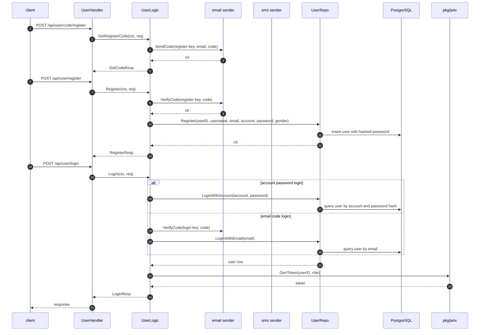
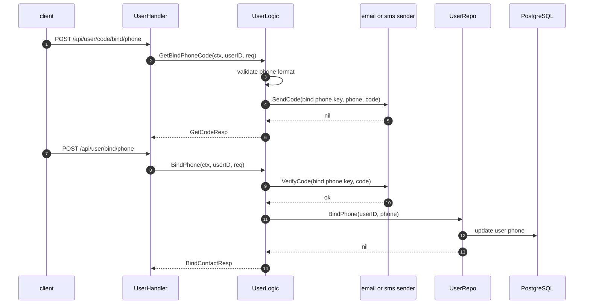
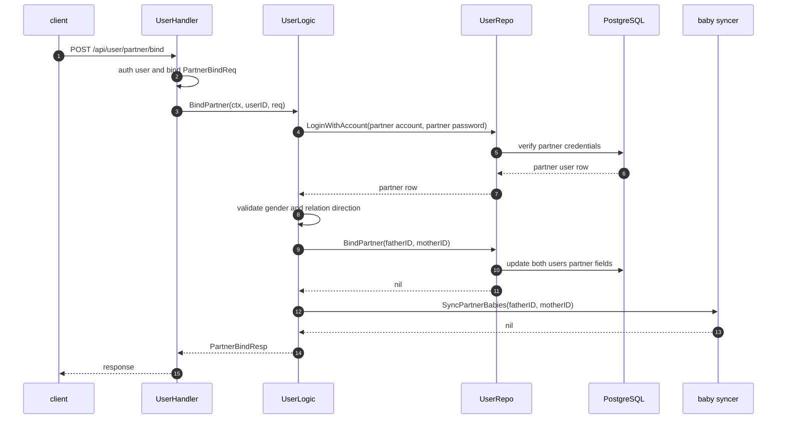
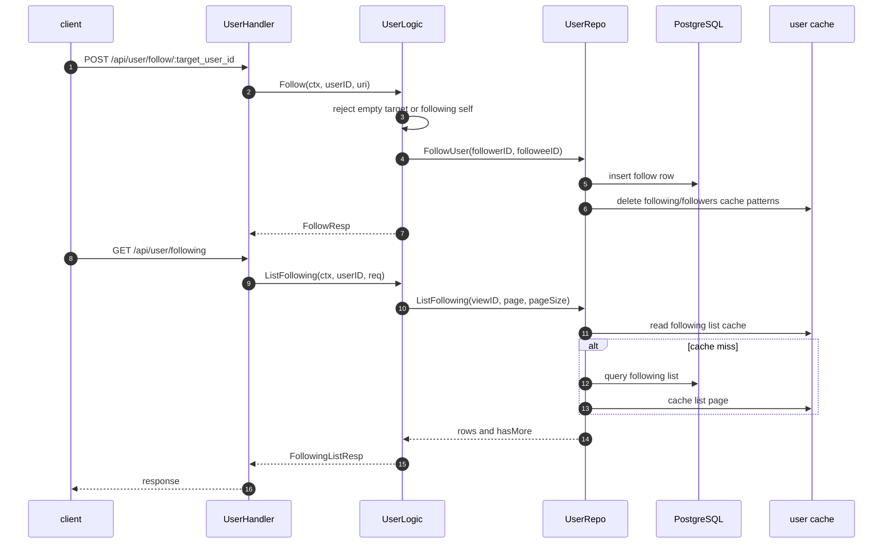

# User 模块主链路

本文档记录 `internal/user` 的主要业务链路。User 模块拥有账号、登录注册、联系方式绑定、伴侣关系、关注关系和用户管理的独立 SQL、repo/cache、handler/logic 边界。

## 模块启动链路

## 注册与登录链路

## 联系方式绑定链路

## 伴侣绑定链路

## 关注链路

## 边界说明

- User 模块对外只暴露伴侣读取、关注读取等小接口给 router 注入到其它模块。
- Email/SMS 是基础设施能力，可以注入测试实现；默认使用 `internal/pkg/emailx` 和 `internal/pkg/smsx`。
- 伴侣绑定后的宝宝同步通过注入的 `BabySyncer` 完成，避免 user 模块直接依赖 baby 模块内部包。
